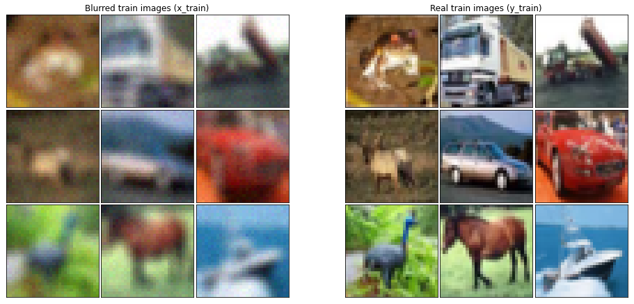

# :bar_chart: Deep Neural Network for Image Denoising 🖼️ :wrench:
This small one-week project was implemented for the *Deep Learning* course of my master in *Artficial Intelligence*. It consists in creating a deblurring Deep Neural Network, aimed to remove *Gaussian blur* and *Gaussian noise* from images. The dataset is built starting from *CIFAR-10* images collection. The noisy version of the images is obtained by applying Gaussian blur and noise to the original images themselves.

  

The metric used to evaluate the results is the *MSE*. Moreover, an visual inspection on the results is illustrated in the notebook.

## Repository structure

    .
    ├── images
    │   ├── example.png                         # Example of original and blurred images
    │   └── model.png                           # Diagram illustrating the DNN model
    ├── previous attempts
    │   ├── DnCNN.ipynb                         # Notebook of a previous attempt using a DnCNN model
    │   ├── autoencoder_with_subtraction.ipynb  # Notebook of a previous attempt using an autoencoder with subtraction
    │   └── naive_autoencoder.ipynb             # Notebook of a previous attempt using a naive autoencoder
    ├── weights
    │   └── weights.h5                          # Weights of the RIDNET DNN
    ├── RIDNET.ipynb                            # Main Notebook of the project using a RIDNET model
    ├── .gitattributes
    ├── .gitignore
    ├── LICENSE
    └── README.md

## Versioning

Git is used for versioning.

## License

This project is licensed under the MIT License - see the [LICENSE](LICENSE) file for details.
 
